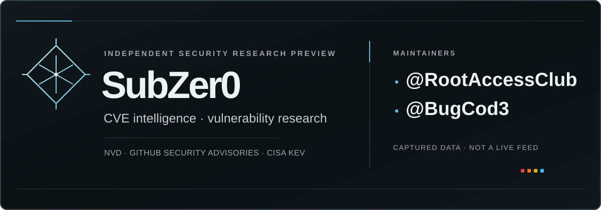

# SubZer0

SubZer0 is a vanilla HTML/CSS/JavaScript CVE intelligence browser published with [GitHub Pages](https://iliya-bashrc.github.io/SubZer0/). It reads versioned JSON from the same site; no backend or vulnerability API is called by the page.

[](https://t.me/RootAccessClub) [](https://t.me/BugCod3)

*SubZer0 is independent and is not affiliated with Telegram.*

## Views

- **Overview** — verified CVE and CISA KEV totals, FIRST EPSS coverage, daily activity, source-check metadata recorded in the capture, and four linked records.
- **Latest** — a source-derived, integrity-checked index of up to 50 records, with local text, source, EPSS minimum and KEV filters.
- **Explore** — the complete captured feed, with search across supplied CVE/product/vendor/source/reference text; separate severity and numeric CVSS minimum filters; activity-date, supplied-vendor, source, EPSS minimum and KEV filters; pagination; and an evidence-led dossier.
- **Archive** — UTC-date counts and links within the current rolling snapshot, not a permanent archive or cross-snapshot history.
- **Community** — the existing terminal-style introduction and Telegram destinations remain a distinct experience. Its displayed `xdg-open` command is a visual simulation; no shell command runs in the browser.

The dossier separates CVSS severity, FIRST EPSS probability, CISA KEV membership and advisory/research leads. Its “Why This Matters” points are assembled from the record’s actual captured evidence, with caveats rather than a combined score or live risk judgment. The current validated record schema has no CWE field; the dossier says when CWE is not supplied instead of inventing a classification.

The compact active-state header becomes a five-item, safe-area-aware bottom navigation on small screens; research rows become stacked cards. The implementation remains dependency-free vanilla HTML, CSS and JavaScript.

## Snapshot status and offline behavior

Freshness labels describe the age and captured source metadata of this static snapshot, not current upstream health. **FRESH** means up to six hours old (the scheduled refresh interval); **DELAYED** is over six and up to 24 hours; **STALE** is older than 24 hours; **DEGRADED** marks recorded source/EPSS issues or failed verification; **OFFLINE** means verified cached snapshot files are being used. Snapshot age is approximate and uses the viewing device’s clock. A source check shown in the interface is the result recorded when the snapshot was generated, not a live check.

A same-origin service worker caches the app shell. The application stores snapshot data only after its size, manifest, hash, schema and relevant cross-file checks pass. When offline, cached files go through the same integrity checks; Explore shows no partial records if any required shard is missing. The cache is best-effort and only contains files that have already been successfully verified in that browser.

While the page is open, it checks the same-origin manifest and compact Overview index every 15 minutes, when a hidden page becomes visible, and after the browser comes back online. A newer manifest and Overview index that pass their schema, size and hash checks produce a reload-or-dismiss notice; full daily shards are verified after reload before Explore shows records. The application does not silently replace the data already on screen. This check does not poll NVD, GitHub, CISA or FIRST, and it does not report GitHub Actions or live source health. The user-activated workflow link opens GitHub Actions history.

The checked-in snapshot was generated at **2026-10-04 17:08:24 UTC**. It contains **14,903 CVE records** across 31 UTC date shards in a rolling 30-day activity window, including **40 CISA KEV records**. Its FIRST EPSS sidecar contains **14,749 scored CVEs** for **2026-10-04**. These counts document this particular capture and are not estimates of current conditions.

## Static data and integrity

GitHub Actions gathers records from the NVD CVE API, GitHub Security Advisory Database, the CISA Known Exploited Vulnerabilities catalog and FIRST EPSS. The refresh workflow runs every six hours (UTC) and can be started manually from `main`. It validates a complete candidate snapshot and exercises the browser before publishing only `snapshot/` to the GitHub Pages source branch. A core-source failure, incomplete pagination, invalid data, failed test or failed validation stops publication and retains the previous complete snapshot. EPSS is optional; retained scores remain explicitly marked stale or unavailable when its source data is stale or missing.

`snapshot/data/overview.json` is a bounded 50-record schema-v2 index containing actual feed records and associated EPSS/KEV evidence when present. Its size and SHA-256 digest appear in the manifest. Overview and Latest verify the manifest and this index; Explore verifies every daily shard and the EPSS file before rendering the complete feed. A hash shows that a downloaded file matches the same-origin manifest; it is **not a digital signature** or independent proof of authenticity.

## Shareable Explore state

The selected page uses `page=overview|latest|center|archive|community`; `center` remains the stable URL name for Explore. Archive links use inclusive UTC `from=YYYY-MM-DD` and `to=YYYY-MM-DD` dates.

Explore supports `search=…`, `severity=critical|high|medium|low|unrated`, `cvssMin=0..10`, `kev=true`, `vendor=…`, `source=NVD|GitHub%20Advisory%20Database|CISA%20KEV`, `epssMin=0..100`, `from=…`, `to=…`, `size=24|48|96`, one-based `pageIndex`, and `cve=CVE-…` for a record detail. CVSS and EPSS thresholds are distinct: records without the relevant score are excluded when a numeric minimum is active, including zero.

Search covers identifiers, titles, descriptions, source labels, supplied affected vendor/product/version/CPE values, KEV vendor/product fields, advisory identifiers/URLs, and reference labels/sources/URLs. The dedicated vendor filter uses only supplied affected-vendor and KEV-vendor fields; product ownership is not inferred.

See the [snapshot manifest](snapshot/manifest.json), [validation record](snapshot/VALIDATION.json), [source and trust notes](SOURCE-NOTES.md), [security audit](AUDIT.md), and [2026-10-04 review report](AUDIT-REPORT-2026-10-04.md).

## Run and validate locally

Serve the repository over HTTP so the browser can load its same-origin files:

```bash
python3 -m http.server 8766 --bind 127.0.0.1
```

Open [Overview](http://127.0.0.1:8766/), [Latest](http://127.0.0.1:8766/?page=latest), [Explore](http://127.0.0.1:8766/?page=center), or [Archive](http://127.0.0.1:8766/?page=archive). Stop the server with `Ctrl+C`.

The deterministic unit tests make no upstream requests. The Playwright browser suites test real checked-in records; the Community suite intercepts Telegram navigation locally. Development dependencies are hash-pinned in `requirements-dev.txt`.

```bash
node --check app.js
node --check sw.js
node --check community.js
python3 -m py_compile scripts/*.py tests/*.py verify_full_feed.py verify_community_ansi_shadow.py
python3 scripts/verify_data_snapshot.py
python3 -m unittest discover -s tests -v
python3 verify_full_feed.py
python3 verify_community_ansi_shadow.py --community-only
```

`scripts/verify_pages.py` checks that the public Pages site serves the expected application assets and a manifest-consistent snapshot. It is intended for post-deployment verification.

## License

No license file is present in this repository, so no license is declared here.
